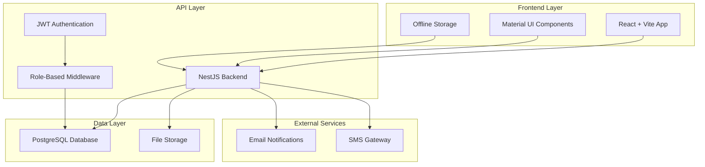
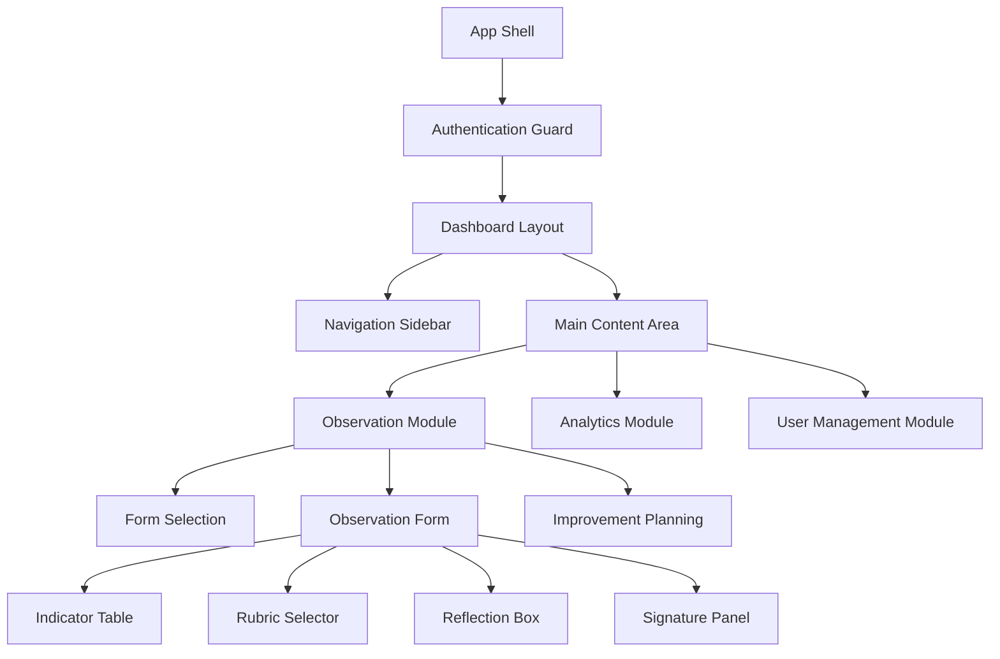
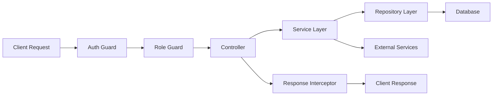
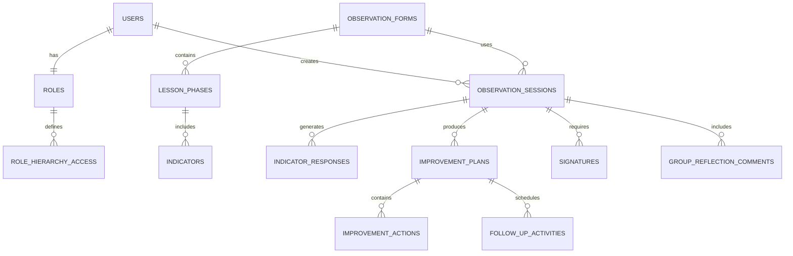

# Design Document

## Overview

The Nationwide Mentoring Platform is designed as a modern, scalable web application that digitizes Cambodia's teacher observation and mentoring processes. The system follows a three-tier architecture with a PostgreSQL database, NestJS backend API, and React frontend, specifically optimized for Khmer language support and hierarchical role-based access control reflecting the MoEYS organizational structure.

The platform transforms paper-based observation forms into dynamic digital interfaces, automates workflow management, and provides comprehensive analytics while maintaining cultural sensitivity and offline capability for remote areas with limited connectivity.

## Architecture

### System Architecture Overview



### Technology Stack

**Frontend:**
- React 18 with TypeScript for type safety
- Vite for fast development and optimized builds
- Material UI (MUI) for consistent, accessible components
- React Hook Form + Zod for form validation
- TanStack Query for server state management
- i18next for internationalization (Khmer primary)
- Workbox for offline functionality

**Backend:**
- NestJS framework with TypeScript
- TypeORM for database abstraction
- JWT for stateless authentication
- Class-validator for input validation
- Swagger for API documentation
- Bull Queue for background job processing

**Database:**
- PostgreSQL 14+ with UUID primary keys
- JSONB columns for flexible metadata storage
- Full-text search capabilities for Khmer text
- Row-level security for data isolation

**Infrastructure:**
- Docker containers for consistent deployment
- Redis for session management and caching
- File storage for signatures and attachments
- HTTPS/TLS encryption for all communications

**Mobile and Offline Support:**
- Progressive Web App (PWA) capabilities for mobile installation
- Service Worker for offline functionality and background sync
- IndexedDB for local data storage and caching
- Responsive design with touch-optimized interfaces
- Camera integration for mobile documentation capture

## Components and Interfaces

### Frontend Component Architecture



### Key Frontend Components

**ObservationForm Component:**
- Dynamic form generation based on grade/subject with role-based filtering
- Real-time validation and auto-save functionality for draft preservation
- Progress tracking and completion status indicators
- Offline capability with sync indicators and conflict resolution
- Automatic session ID generation and timestamp tracking

**IndicatorTable Component:**
- Grid-based interface for efficient data entry with touch optimization
- Support for both 1-3 scale and checkbox rubrics based on indicator type
- Contextual help and rubric descriptions in Khmer
- Keyboard navigation for accessibility compliance
- Mobile-responsive design for field observations

**ReflectionComponent:**
- Structured fields for strengths, challenges, and recommendations
- Integration with improvement plan template generation
- Rich text editing with Khmer language support
- Auto-save functionality to prevent data loss

**SignaturePanel Component:**
- Digital signature capture for both observer and teacher
- Signature validation and verification logic
- Integration with approval workflow system
- Audit trail maintenance for signature activities

**HierarchyFilter Component:**
- Role-aware entity selection (schools, teachers, etc.)
- Geographic scope filtering based on user permissions
- Search and autocomplete functionality with Khmer text support
- Breadcrumb navigation for hierarchical context

**AnalyticsDashboard Component:**
- Interactive charts and visualizations with drill-down capabilities
- Role-based KPI display relevant to user scope
- Export functionality for reports in multiple formats (PDF, Excel, CSV)
- Real-time data updates with proper Khmer text encoding
- Benchmarking and comparison tools across authorized geographic areas

**NotificationCenter Component:**
- Follow-up activity due date notifications
- Approval workflow status updates
- System alerts and reminders
- Multi-channel notification support (in-app, email)

### Backend API Architecture



### Core API Modules

**Authentication Module:**
- JWT token generation and validation with appropriate expiration times
- Role-based permission checking with real-time updates
- Session management and refresh tokens
- Password reset and account recovery
- Audit logging for authentication events

**Observation Module:**
- Form template management with grade/subject-specific configurations
- Session CRUD operations with draft auto-save capability
- Indicator response handling with validation
- Signature capture and validation
- Session workflow management (draft, in-progress, completed)

**Hierarchy Module:**
- User role and scope management with seven-tier MoEYS structure
- Geographic entity relationships and access control
- Permission inheritance logic with immediate updates
- Access control enforcement at data level
- Approval workflow routing based on hierarchy

**Improvement Planning Module:**
- Improvement plan creation and management
- Follow-up activity scheduling and tracking
- Progress monitoring and status updates
- Notification system for due dates and reminders
- Integration with observation session outcomes

**Analytics Module:**
- Data aggregation and reporting with role-based filtering
- Performance metrics calculation and trend analysis
- Export service integration (PDF, Excel, CSV) with Khmer support
- Benchmarking and comparison functionality
- Real-time dashboard data provision

**Notification Module:**
- Multi-channel notification delivery (in-app, email)
- Due date and reminder management
- Workflow status update notifications
- Configurable notification preferences

## Data Models

### Core Entity Relationships



### Key Data Models

**User Model:**
```typescript
interface User {
  id: string;
  username: string;
  email: string;
  fullName: string;
  role: UserRole;
  locationScope: LocationScope;
  isActive: boolean;
  lastLogin: Date;
  createdAt: Date;
  updatedAt: Date;
}
```

**ObservationSession Model:**
```typescript
interface ObservationSession {
  id: string;
  formId: string;
  schoolName: string;
  teacherName: string;
  observerName: string;
  subject: string;
  grade: string;
  dateObserved: Date;
  startTime: string;
  endTime: string;
  classificationLevel: string;
  status: SessionStatus;
  reflectionSummary: string;
  createdAt: Date;
  updatedAt: Date;
}
```

**IndicatorResponse Model:**
```typescript
interface IndicatorResponse {
  id: string;
  sessionId: string;
  indicatorId: string;
  selectedScore: number;
  selectedLevel: string;
  notes: string;
  createdAt: Date;
}
```

**ImprovementPlan Model:**
```typescript
interface ImprovementPlan {
  id: string;
  sessionId: string;
  goals: string;
  actions: ImprovementAction[];
  timeline: string;
  responsibleParty: string;
  status: PlanStatus;
  createdAt: Date;
  updatedAt: Date;
}
```

**FollowUpActivity Model:**
```typescript
interface FollowUpActivity {
  id: string;
  planId: string;
  description: string;
  dueDate: Date;
  assignedTo: string;
  status: ActivityStatus;
  completedAt?: Date;
  notes: string;
}
```

**Signature Model:**
```typescript
interface Signature {
  id: string;
  sessionId: string;
  signerRole: 'observer' | 'teacher';
  signerName: string;
  signatureData: string;
  timestamp: Date;
  ipAddress: string;
  isValid: boolean;
}
```

### Role Hierarchy Model

The system implements a seven-tier hierarchy reflecting MoEYS structure:

1. **Administrator** - Nationwide access and control
2. **Zone** - Regional management across provinces
3. **Provincial** - Province-wide oversight
4. **Department** - Department and cluster management
5. **Cluster** - Multi-school coordination
6. **Director** - School-level administration
7. **Teacher** - Individual access and self-assessment

Each role has defined permissions for viewing, managing, and approving within their scope.

## Localization and Mobile Design

### Khmer Language Support Strategy

**Text Rendering and Input:**
- Unicode-compliant Khmer text rendering across all components
- Proper font selection for Khmer script display
- Input method editor (IME) support for Khmer text entry
- Right-to-left text alignment where culturally appropriate
- Khmer numeral system support with fallback to Arabic numerals

**Cultural Adaptation:**
- Date formatting according to Cambodian conventions (Buddhist calendar support)
- Number formatting with Khmer locale settings
- Currency display in Cambodian Riel with proper formatting
- Time zone handling for Cambodia Standard Time (ICT)
- Cultural color schemes and iconography preferences

**Content Management:**
- Translation key management system for all UI text
- Dynamic content translation for form labels and instructions
- Contextual help text in Khmer for complex workflows
- Error messages and validation feedback in Khmer
- Report templates with Khmer headers and formatting

### Mobile-First Design Approach

**Responsive Interface Design:**
- Mobile-first CSS approach with progressive enhancement
- Touch-optimized button sizes (minimum 44px touch targets)
- Gesture-based navigation for mobile workflows
- Adaptive layouts for portrait and landscape orientations
- Optimized typography scales for mobile readability

**Offline-First Architecture:**
- Service Worker implementation for offline functionality
- Background sync for data synchronization when online
- Local storage management with automatic cleanup
- Conflict resolution strategies for concurrent edits
- Progressive data loading to minimize bandwidth usage

**Mobile-Specific Features:**
- Camera integration for capturing classroom documentation
- GPS location services for automatic school identification
- Push notifications for follow-up reminders
- Biometric authentication support where available
- Device storage optimization for limited space scenarios

**Performance Optimization:**
- Lazy loading for non-critical components
- Image compression and optimization for mobile networks
- Minimal JavaScript bundle sizes for faster loading
- Efficient caching strategies for frequently accessed data
- Network-aware loading strategies based on connection quality

## Error Handling

### Frontend Error Handling Strategy

**Network Errors:**
- Automatic retry with exponential backoff
- Offline mode activation when network unavailable
- User-friendly error messages in Khmer
- Graceful degradation of functionality

**Validation Errors:**
- Real-time field validation with immediate feedback
- Form-level validation before submission
- Clear error messaging with correction guidance
- Prevention of data loss during error states

**Authentication Errors:**
- Automatic token refresh handling
- Secure logout on authentication failure
- Session timeout warnings
- Redirect to login with context preservation

### Backend Error Handling

**Database Errors:**
- Connection pool management and recovery
- Transaction rollback on failures
- Detailed logging for debugging
- Graceful error responses to clients

**Business Logic Errors:**
- Custom exception classes for different error types
- Validation pipe integration with class-validator
- Structured error responses with error codes
- Audit trail for error tracking

**External Service Errors:**
- Circuit breaker pattern for service calls
- Fallback mechanisms for non-critical services
- Timeout handling and retry logic
- Service health monitoring

## Testing Strategy

### Frontend Testing Approach

**Unit Testing:**
- Jest for component logic testing
- React Testing Library for component rendering
- Mock service workers for API mocking
- Coverage targets: 80% for critical components

**Integration Testing:**
- Cypress for end-to-end user workflows
- API integration testing with real backend
- Cross-browser compatibility testing
- Mobile responsiveness validation

**Accessibility Testing:**
- Automated a11y testing with axe-core
- Screen reader compatibility verification
- Keyboard navigation testing
- Color contrast and visual accessibility

### Backend Testing Strategy

**Unit Testing:**
- Jest for service and controller testing
- Mock repositories for isolated testing
- Test data factories for consistent fixtures
- Coverage targets: 85% for business logic

**Integration Testing:**
- Supertest for API endpoint testing
- Test database with realistic data
- Authentication and authorization testing
- Database transaction testing

**Performance Testing:**
- Load testing with realistic user scenarios
- Database query performance optimization
- Memory usage and leak detection
- API response time monitoring

### Testing Data Management

**Test Data Strategy:**
- Seed data scripts for consistent test environments
- Factory pattern for generating test entities
- Database cleanup between test runs
- Realistic Khmer text data for localization testing

**Continuous Integration:**
- Automated test execution on code changes
- Test result reporting and notifications
- Code coverage tracking and enforcement
- Deployment blocking on test failures

### Security Testing

**Authentication Testing:**
- JWT token validation and expiration
- Role-based access control verification
- Session management security
- Password security and hashing

**Data Security Testing:**
- SQL injection prevention testing
- XSS vulnerability scanning
- CSRF protection verification
- Data encryption validation

**Infrastructure Security:**
- HTTPS/TLS configuration testing
- Database connection security
- File upload security validation
- API rate limiting verification